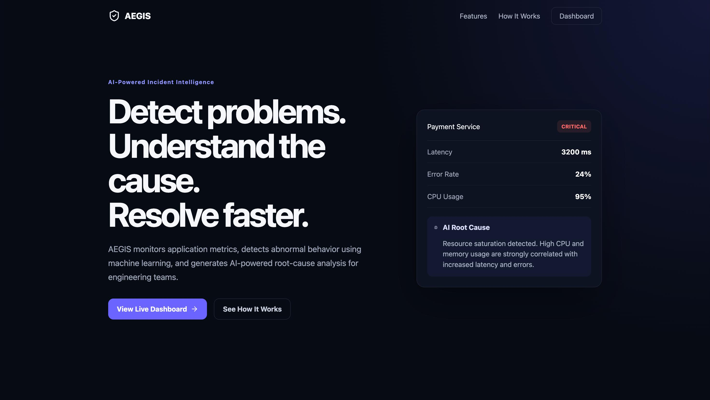
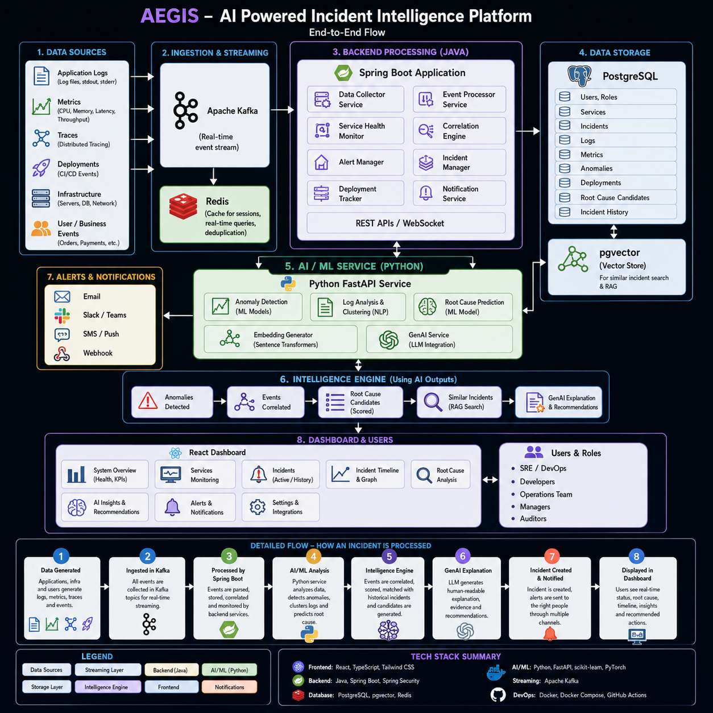
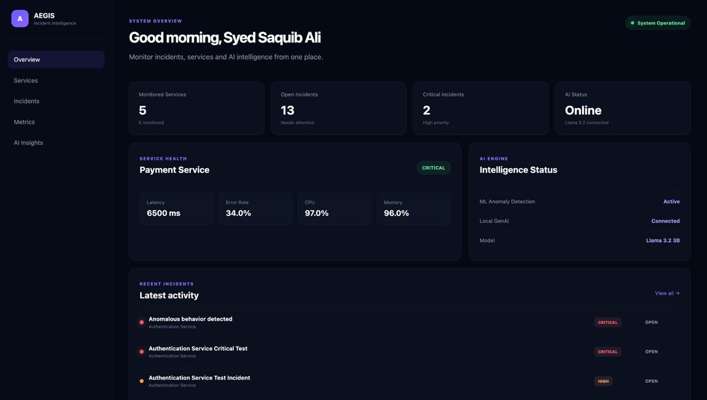
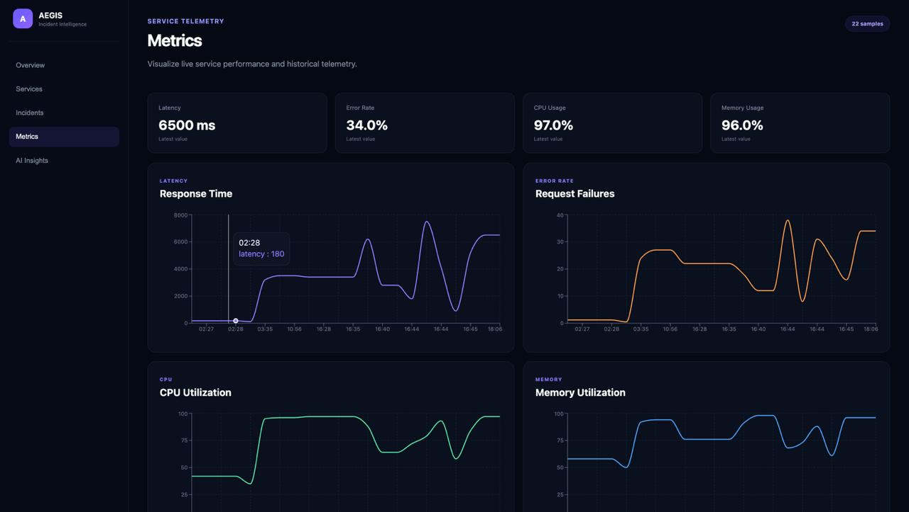
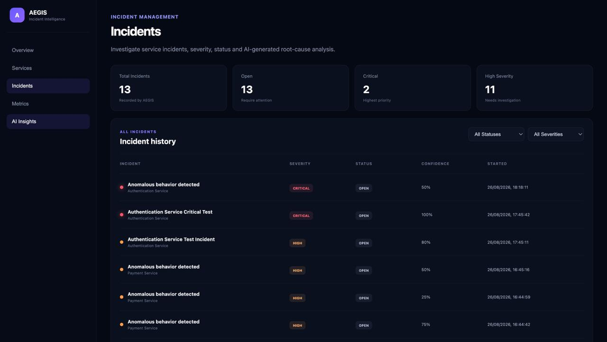

# 🛡️ AEGIS — AI-Powered Incident Intelligence Platform

<p align="center">
  <b>Intelligent Service Monitoring • Anomaly Detection • Automated Incident Management • GenAI Root-Cause Analysis</b>
</p>

<p align="center">
  A full-stack incident intelligence platform that monitors service telemetry, detects anomalous behavior, automatically creates incidents, and uses <b>Llama 3.2 via Ollama</b> to generate AI-powered root-cause analysis.
</p>

<p align="center">
  
  
  
  
  
  
</p>

---

## 🌐 Live Demo

<p align="center">
  <a href="https://tryaegis-ai.vercel.app/">
    
  </a>
</p>

<p align="center">
  <b>Live Application</b><br>
  <a href="https://tryaegis-ai.vercel.app/">
    https://tryaegis-ai.vercel.app/
  </a>
</p>

### ⚠️ Demo Deployment Notice

> **AEGIS is currently deployed using free-tier infrastructure for demonstration and portfolio purposes.**
>
> The React frontend is hosted on **Vercel**, while the Spring Boot backend and AI analysis service are hosted on **Render**.
>
> Free-tier cloud services may enter an idle state when they have not received traffic. Because of this, the **first request may take approximately 30–60 seconds** while the backend services wake up.
>
> After the initial cold start, subsequent requests should respond normally.
>
> The Generative AI component uses **Llama 3.2 3B through Ollama running locally on the developer's Mac**. During live AI demonstrations, the deployed AI service communicates with the local LLM through a secure tunnel.
>
> Existing services, metrics, incidents, and previously generated AI root-cause reports remain persisted and can still be viewed when the local LLM is offline. **Generating a new Llama-powered root-cause report requires the local Ollama runtime and tunnel to be online.**

### Deployment Status

| Component | Deployment | Notes |
|---|---|---|
| 🌐 Frontend | **Vercel** | Publicly accessible |
| ☕ Spring Boot Backend | **Render** | Free tier — may experience cold starts |
| 🧠 AI Analysis Service | **Render** | Free tier — may experience cold starts |
| 🗄️ PostgreSQL | **Cloud Database** | Persistent application data |
| 🤖 Llama 3.2 3B | **Local Ollama Runtime** | Runs on developer machine |
| 🔗 Local AI Connectivity | **Secure Tunnel** | Enabled during live GenAI demonstrations |

> 💡 **For reviewers:** If dashboard data does not populate immediately, please allow approximately **one minute** for the free-tier services to wake up, then refresh the application.

---

## 📌 Overview

**AEGIS** is an AI-powered service monitoring and incident intelligence platform designed to demonstrate how traditional observability can be combined with **Machine Learning and Generative AI**.

Instead of simply displaying service metrics, AEGIS processes incoming telemetry, identifies anomalous behavior, automatically creates incidents, calculates their severity and confidence score, and generates an AI-assisted root-cause analysis.

The complete flow works automatically:

```text
Service Telemetry
       ↓
Spring Boot Backend
       ↓
Metric Persistence
       ↓
ML Anomaly Detection
       ↓
Anomaly Detected
       ↓
Llama 3.2 Root-Cause Analysis
       ↓
Incident Creation
       ↓
Severity + Confidence Scoring
       ↓
Database Persistence
       ↓
React Dashboard
```

---

## 🖥️ Landing Page

<p align="center">
  
</p>

- 📡 **Service Monitoring** — Monitor multiple application services from a centralized dashboard.
- 📊 **Live Metrics** — Track latency, error rate, CPU usage, memory usage, and throughput.
- 🤖 **ML Anomaly Detection** — Automatically identify abnormal service behavior.
- 🧠 **AI Root-Cause Analysis** — Generate intelligent incident analysis using **Llama 3.2 via Ollama**.
- 🚨 **Automatic Incident Creation** — Convert detected anomalies into persistent incidents automatically.
- 🔴 **Dynamic Severity Detection** — Classify incidents as `HIGH` or `CRITICAL` based on operational thresholds.
- 🎯 **Confidence Scoring** — Calculate incident confidence using multiple abnormal telemetry signals.
- 🗄️ **Persistent Incident History** — Store services, metrics, incidents, and AI-generated root causes in PostgreSQL.
- 🛡️ **Graceful AI Fallback** — Keep the monitoring system operational even when the GenAI layer is temporarily unavailable.
- ☁️ **Hybrid Deployment** — React on Vercel, Spring Boot & FastAPI on Render, with Ollama running locally.

---

# ✨ Key Features

## 📡 Multi-Service Monitoring

AEGIS can monitor multiple independent application services from a centralized dashboard.

Current demonstration services include:

- Payment Service
- Authentication Service
- API Gateway
- Order Service
- Database Service

Each monitored service maintains its own telemetry and operational status.

---

## 📊 Service Telemetry

AEGIS currently processes five core operational signals:

```text
Latency
Error Rate
CPU Usage
Memory Usage
Throughput
```

Incoming metrics are associated with their monitored service, persisted, and passed into the analysis pipeline.

---

## 🤖 ML-Based Anomaly Detection

Incoming telemetry is analyzed to determine whether the current service behavior represents an anomaly.

Example response:

```json
{
  "anomaly": true,
  "rawScore": -0.1059892495,
  "message": "Anomalous behavior detected"
}
```

If no anomaly is detected, the metric remains stored without creating an unnecessary incident.

When anomalous behavior is identified, AEGIS automatically continues into the incident-intelligence pipeline.

---

## 🧠 GenAI Root-Cause Analysis

When an anomaly is detected, AEGIS invokes **Llama 3.2 3B running through Ollama**.

The LLM receives relevant service telemetry and generates an incident analysis containing information such as:

- Incident summary
- Most likely root cause
- Technical explanation
- Recommended remediation actions

Unlike a standalone chatbot response, the generated analysis becomes part of the application's incident record.

The report is persisted in the database and remains available for future review.

---

## 🚨 Automatic Incident Creation

An anomalous metric automatically triggers incident creation.

```text
Metric Received
      ↓
Metric Persisted
      ↓
Anomaly Detection
      ↓
Anomaly Found
      ↓
GenAI Root Cause
      ↓
Severity Calculation
      ↓
Confidence Calculation
      ↓
Incident Persisted
      ↓
Dashboard Updated
```

No manual incident creation is required for the automated workflow.

---

## ⚠️ Dynamic Severity Classification

AEGIS automatically distinguishes between **HIGH** and **CRITICAL** incidents.

Examples of critical operational thresholds include:

```text
Latency     >= 5000 ms
Error Rate  >= 30%
CPU Usage   >= 95%
Memory      >= 95%
```

When an anomaly crosses one or more critical thresholds, the generated incident is classified as:

```text
CRITICAL
```

Otherwise, anomalous behavior can be classified as:

```text
HIGH
```

This approach keeps operational severity deterministic while allowing Generative AI to focus on diagnosis and explanation.

---

## 🎯 Confidence Scoring

AEGIS calculates a confidence score using the number of severe telemetry signals detected during the incident.

Signals currently considered include:

```text
High Latency
Elevated Error Rate
CPU Saturation
Memory Saturation
```

For example:

```text
Latency abnormal      +0.25
Error rate abnormal   +0.25
CPU abnormal          +0.25
Memory abnormal       +0.25
                      ─────
Maximum confidence     1.00
```

This gives each incident additional context about the strength of the observed failure signals.

---

## 🛡️ Graceful AI Failure Handling

The monitoring pipeline is designed so that temporary AI failures do **not** crash the core application.

If anomaly analysis becomes temporarily unavailable:

```text
Metric Received
      ↓
Metric Saved
      ↓
AI Temporarily Unavailable
      ↓
Graceful Fallback
      ↓
Backend Remains Operational
```

This separates critical monitoring functionality from optional AI enrichment.

AEGIS therefore demonstrates both:

```text
AI AVAILABLE
     ↓
Full GenAI incident intelligence
```

and:

```text
AI UNAVAILABLE
     ↓
Core monitoring remains operational
```

---

# 🏗️ System Architecture

<p align="center">
  
</p>

```text
┌──────────────────────────────┐
│        React Frontend        │
│            Vercel            │
└──────────────┬───────────────┘
               │
               │ REST / JSON
               ▼
┌──────────────────────────────┐
│     Spring Boot Backend      │
│            Render            │
│                              │
│  • Service Management        │
│  • Metric Processing         │
│  • Incident Management       │
│  • Severity Classification   │
│  • Confidence Scoring        │
└──────────┬──────────┬────────┘
           │          │
           │          │
           ▼          ▼
┌────────────────┐  ┌─────────────────────┐
│   PostgreSQL   │  │ AI Analysis Service │
│                │  │ FastAPI / Render    │
│ • Services     │  └──────────┬──────────┘
│ • Metrics      │             │
│ • Incidents    │             │
└────────────────┘             ▼
                       ┌───────────────────┐
                       │   Secure Tunnel   │
                       └─────────┬─────────┘
                                 │
                                 ▼
                       ┌───────────────────┐
                       │   Local Mac       │
                       │                   │
                       │ Ollama            │
                       │ Llama 3.2 3B      │
                       └───────────────────┘
```

---

# 🔄 End-to-End Incident Workflow

## 1️⃣ Metric Ingestion

A service sends operational telemetry to AEGIS.

Example:

```json
{
  "latency": 3200,
  "errorRate": 37,
  "cpuUsage": 86,
  "memoryUsage": 81,
  "throughput": 90
}
```

---

## 2️⃣ Metric Persistence

Spring Boot associates the incoming metric with the corresponding monitored service and stores it in the database.

This means telemetry is retained independently of whether subsequent AI analysis succeeds.

---

## 3️⃣ Service Health Calculation

AEGIS evaluates deterministic operational thresholds and updates the service health.

Possible states include:

```text
HEALTHY
DEGRADED
CRITICAL
```

---

## 4️⃣ Anomaly Detection

The saved telemetry is sent to the AI analysis service.

The analysis layer determines whether the current behavior is anomalous.

```text
Normal
  ↓
Metric remains stored

Anomaly
  ↓
Incident pipeline begins
```

---

## 5️⃣ GenAI Root-Cause Analysis

When anomalous behavior is identified, AEGIS sends the relevant telemetry to Llama 3.2.

The model generates a technical root-cause analysis and recommended actions.

---

## 6️⃣ Incident Intelligence

Spring Boot creates the incident and calculates:

```text
Affected Service
Incident Severity
Incident Status
Confidence Score
Root-Cause Analysis
Detection Timestamp
```

---

## 7️⃣ Incident Persistence

The completed incident is persisted in PostgreSQL.

This means previously generated AI analysis remains accessible even after the local AI runtime is switched off.

---

## 8️⃣ Dashboard Update

The React frontend retrieves the latest application state and displays the newly generated incident.

The dashboard automatically reflects updated:

```text
Open Incidents
Critical Incidents
Service Health
Recent Incidents
Metrics
```

---

# 📸 Application Screenshots

## System Overview

<p align="center">
  
</p>

The dashboard provides a centralized overview of service health, operational metrics, incidents, and AI status.

---

## Live Service Metrics

<p align="center">
  
</p>

Service telemetry includes latency, error rate, CPU utilization, memory utilization, and throughput.

---

## Automatically Generated Critical Incident

<p align="center">
  
</p>

The example above demonstrates an automatically generated **CRITICAL Authentication Service incident** produced through the full anomaly-detection pipeline.

```text
Authentication Service
        ↓
Abnormal Metrics
        ↓
Anomaly Detected
        ↓
AI Root-Cause Analysis
        ↓
CRITICAL Incident
        ↓
Database
        ↓
Dashboard
```

---

# 🧰 Technology Stack

| Layer | Technology |
|---|---|
| **Frontend** | React.js, JavaScript, CSS |
| **Backend** | Java, Spring Boot |
| **ORM** | Spring Data JPA, Hibernate |
| **Database** | PostgreSQL |
| **AI Service** | Python, FastAPI |
| **Machine Learning** | Anomaly Detection |
| **Generative AI** | Llama 3.2 3B |
| **LLM Runtime** | Ollama |
| **Architecture** | REST / JSON |
| **Frontend Deployment** | Vercel |
| **Backend Deployment** | Render |
| **AI Service Deployment** | Render |
| **Local AI Connectivity** | Secure Tunnel |
| **API Testing** | Postman |
| **Version Control** | Git & GitHub |
| **Development Environment** | VS Code |

---

# 📂 Project Structure

```text
aegis/
│
├── backend/
│   │
│   └── src/main/java/com/aegis/backend/
│       │
│       ├── config/
│       ├── controller/
│       ├── entity/
│       ├── repository/
│       └── service/
│
├── frontend/
│   │
│   └── src/
│       │
│       ├── components/
│       ├── pages/
│       └── api/
│
├── ai-service/
│   │
│   ├── main.py
│   └── requirements.txt
│
├── docs/
│   │
│   └── screenshots/
│       ├── dashboard-overview.png
│       ├── dashboard-metrics.png
│       ├── dashboard-ai-incident.png
│       └── architecture.png
│
└── README.md
```

---

# 🔌 REST API

## Services

| Method | Endpoint | Description |
|---|---|---|
| `GET` | `/api/services` | Retrieve monitored services |
| `POST` | `/api/services` | Register a monitored service |

---

## Metrics

| Method | Endpoint | Description |
|---|---|---|
| `GET` | `/api/metrics/service/{serviceId}` | Retrieve service telemetry |
| `POST` | `/api/metrics/service/{serviceId}` | Record and analyze telemetry |

---

## Incidents

| Method | Endpoint | Description |
|---|---|---|
| `GET` | `/api/incidents` | Retrieve incidents |
| `GET` | `/api/incidents/{id}` | Retrieve incident details |
| `POST` | `/api/incidents/service/{serviceId}` | Create an incident |
| `PUT` | `/api/incidents/{id}/resolve` | Resolve an incident |

---

# 🧪 Example Anomaly Request

A service metric can be submitted using:

```bash
curl -X POST http://localhost:8080/api/metrics/service/1 \
  -H "Content-Type: application/json" \
  -d '{
    "latency": 6500,
    "errorRate": 34,
    "cpuUsage": 97,
    "memoryUsage": 96,
    "throughput": 45
  }'
```

Example response:

```json
{
  "anomaly": true,
  "message": "Anomalous behavior detected"
}
```

When:

```text
anomaly = true
```

the backend automatically continues with:

```text
Root-Cause Analysis
        ↓
Severity Calculation
        ↓
Confidence Calculation
        ↓
Incident Creation
        ↓
Database Persistence
```

---

# 💻 Running AEGIS Locally

## Prerequisites

Install:

```text
Java 17+
Node.js
npm
Python 3
PostgreSQL
Ollama
Git
```

---

## 1️⃣ Clone the Repository

```bash
git clone YOUR_GITHUB_REPOSITORY_URL
cd aegis
```

---

## 2️⃣ Start Ollama

Download the model:

```bash
ollama pull llama3.2:3b
```

Start Ollama:

```bash
ollama serve
```

Verify that Ollama is available:

```bash
curl http://localhost:11434/api/tags
```

---

## 3️⃣ Start the AI Service

```bash
cd ai-service
```

Create a virtual environment:

```bash
python3 -m venv venv
```

Activate it:

```bash
source venv/bin/activate
```

Install dependencies:

```bash
pip install -r requirements.txt
```

Start FastAPI:

```bash
uvicorn main:app --reload --port 8000
```

---

## 4️⃣ Start Spring Boot

Open another terminal:

```bash
cd backend
```

Configure the AI service:

```bash
export AI_SERVICE_URL=http://localhost:8000
```

Start Spring Boot:

```bash
./mvnw spring-boot:run
```

The backend should now be available at:

```text
http://localhost:8080
```

---

## 5️⃣ Start React

Open another terminal:

```bash
cd frontend
```

Install dependencies:

```bash
npm install
```

Start the development server:

```bash
npm run dev
```

Open the URL displayed by Vite.

---

# ☁️ Deployment Architecture

AEGIS currently uses a **hybrid cloud + local AI architecture**.

```text
                     INTERNET
                        │
                        ▼
             ┌─────────────────────┐
             │   React Frontend    │
             │       Vercel        │
             └──────────┬──────────┘
                        │
                     REST API
                        │
                        ▼
             ┌─────────────────────┐
             │ Spring Boot Backend │
             │       Render        │
             └──────┬────────┬─────┘
                    │        │
                    │        ▼
                    │  ┌─────────────────┐
                    │  │ AI Analysis     │
                    │  │ FastAPI/Render  │
                    │  └────────┬────────┘
                    │           │
                    │           ▼
                    │    Secure AI Tunnel
                    │           │
                    │           ▼
                    │  ┌─────────────────┐
                    │  │ Local Mac       │
                    │  │                 │
                    │  │ Ollama          │
                    │  │ Llama 3.2 3B    │
                    │  └─────────────────┘
                    │
                    ▼
             ┌─────────────────────┐
             │     PostgreSQL      │
             │ Persistent Storage  │
             └─────────────────────┘
```

---

# 🤖 Why Local GenAI?

AEGIS intentionally supports a locally hosted LLM instead of depending entirely on a paid external LLM API.

This architecture demonstrates:

- Local LLM deployment
- Ollama integration
- LLM API communication
- Hybrid cloud/local architecture
- GenAI integration with Spring Boot
- AI availability handling
- Zero-cost local inference during development
- Separation between core monitoring and AI enrichment

---

## 🟢 AI Online

When Ollama and the secure tunnel are available:

```text
Metric
  ↓
Anomaly Detection
  ↓
Anomaly Identified
  ↓
Llama 3.2
  ↓
Root-Cause Analysis
  ↓
Incident Created
  ↓
Database
  ↓
Dashboard
```

---

## 🔴 AI Offline

If the local AI runtime becomes unavailable:

```text
Metric
  ↓
Spring Boot
  ↓
Metric Saved
  ↓
AI Request Fails Gracefully
  ↓
Fallback Response
  ↓
Application Remains Operational
```

This prevents temporary GenAI availability from taking down the core monitoring system.

---

# 🔐 Environment Variables

## Spring Boot

Local environment:

```env
AI_SERVICE_URL=http://localhost:8000
```

In production, this points to the deployed AI analysis service.

---

## AI Service

Local Ollama:

```env
OLLAMA_BASE_URL=http://localhost:11434
```

For hybrid deployment, the AI service can be configured to communicate with the local Ollama runtime through a secure tunnel.

> ⚠️ **Security Notice:** Never commit production database passwords, API keys, access tokens, environment secrets, or tunnel credentials to GitHub.

Use environment variables or the hosting platform's secret-management functionality instead.

---

# 🧠 Why AEGIS?

Traditional monitoring platforms can tell an engineer:

> **"Something is wrong."**

AEGIS explores the next step:

> **"Something is wrong. How serious is it, what probably caused it, and what should an engineer investigate next?"**

The project combines:

```text
Observability
      +
Backend Engineering
      +
Machine Learning
      +
Generative AI
      +
Incident Management
```

into a single end-to-end application.

---

# 🎯 Engineering Objectives

AEGIS was built to explore how **Java/Spring Boot backend systems can integrate with Machine Learning and locally hosted Generative AI** to provide intelligent operational tooling.

Rather than implementing GenAI as a standalone chatbot, the LLM is integrated into an actual backend workflow:

```text
Operational Data
      ↓
Application Logic
      ↓
Machine Learning
      ↓
Generative AI
      ↓
Persistent Domain Object
      ↓
User Interface
```

The AI output therefore becomes part of the application's incident-management system.

---

# 💡 Technical Highlights

### Backend Engineering

- Layered Spring Boot architecture
- RESTful APIs
- Service/repository separation
- JPA entity relationships
- PostgreSQL persistence
- Dynamic service health
- Incident lifecycle management
- Fault-tolerant AI integration

### AI Engineering

- Dedicated FastAPI AI service
- ML anomaly analysis
- Ollama integration
- Llama 3.2 inference
- Structured root-cause generation
- Graceful AI fallback

### Frontend Engineering

- React-based dashboard
- REST API integration
- Dynamic incident counters
- Service telemetry visualization
- Multi-page monitoring interface
- AI status presentation

### Cloud & Deployment

- Vercel frontend deployment
- Render Spring Boot deployment
- Render FastAPI deployment
- Cloud PostgreSQL
- Hybrid local/cloud GenAI connectivity

---

# 🚀 Future Enhancements

Potential future improvements include:

- Real-time telemetry ingestion
- WebSocket dashboard updates
- Dockerized deployment
- Kubernetes integration
- Prometheus metric ingestion
- Grafana integration
- Authentication and RBAC
- Slack incident notifications
- Email alerts
- Historical incident analytics
- MTTR tracking
- Service-level objectives
- AI incident summarization
- Automated remediation recommendations
- Vector-based incident knowledge base
- RAG using historical incidents
- Multi-model AI support
- Cloud-hosted Ollama deployment
- CI/CD pipeline
- Automated testing
- OpenTelemetry integration

---

# 🔗 Project Links

| Resource | Link |
|---|---|
| 🚀 **Live Application** | [Launch AEGIS](https://tryaegis-ai.vercel.app/) |
| 💻 **Source Code** | This GitHub Repository |
| 🌐 **Frontend** | Vercel |
| ☕ **Backend** | Spring Boot / Render |
| 🧠 **AI Engine** | FastAPI + Ollama + Llama 3.2 3B |
| 🗄️ **Persistence** | PostgreSQL |

---

# 🎬 Quick Demo Instructions

### 1. Launch AEGIS

Open:

**[🚀 AEGIS Live Demo](https://tryaegis-ai.vercel.app/)**

### 2. Allow for cold start

Because the project uses free-tier infrastructure, allow approximately:

```text
30–60 seconds
```

for backend services to wake up on the first request.

Refresh the application if necessary.

### 3. Explore the Dashboard

The dashboard displays:

```text
Monitored Services
Open Incidents
Critical Incidents
Service Health
Latest Metrics
AI Engine Status
Recent Incidents
```

### 4. Explore Services

Open the **Services** section to inspect the monitored application services.

### 5. Explore Metrics

Open **Metrics** to inspect captured service telemetry and historical values.

### 6. Explore Incidents

Open **Incidents** to view persisted incidents created by the monitoring pipeline.

Previously generated AI root-cause reports remain available from the database.

### 7. Live AI Demonstration

During a developer-led demonstration, anomalous telemetry can be submitted to trigger:

```text
Metric Submission
       ↓
Anomaly Detection
       ↓
Llama Root-Cause Analysis
       ↓
Automatic Incident
       ↓
Dashboard Update
```

> **Note:** Creating a new Llama-powered root-cause report requires the developer's local Ollama runtime and secure tunnel to be online. Previously persisted incidents and AI reports remain available independently.

---

# 👨‍💻 Author

## Syed Saquib Ali

**Computer Science & Engineering**

Java • Spring Boot • React • REST APIs • SQL • Python • AI/ML • Generative AI • LLM Integration

---

<p align="center">
  <b>AEGIS — From anomaly detection to intelligent incident response.</b>
</p>

<p align="center">
  Built with ☕ Java, ⚛️ React, 🐍 Python and 🧠 Llama 3.2
</p>

<p align="center">
  ⭐ If you found AEGIS interesting, consider starring the repository.
</p>
